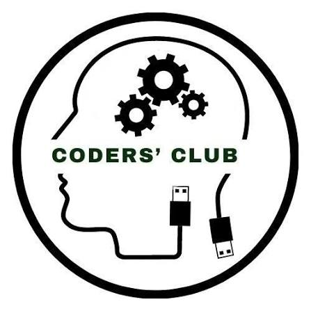

# CodeX 4.0 AI Assistant & Live Campus Navigator 🚀

> Official full-stack AI chatbot and interactive campus navigation portal for **CodeX 4.0**, organized by **Coders' Club** at **G. Pulla Reddy Engineering College (GPREC), Kurnool**.



---

## 🌟 Overview

The **CodeX 4.0 Chatbot** is a production-ready, full-stack Retrieval-Augmented Generation (RAG) assistant designed to provide real-time, accurate information about:
- **CodeX 4.0 Hackathon**: Event schedule, problem tracks, team format, guidelines, and ₹50,000 prize pool.
- **Interactive Campus Navigation**: In-app live GPS road navigation with real turn-by-turn routing, realistic travel duration/distance, voice guidance, and multi-layer maps (Vector Roadmap, Satellite Aerial, and OpenStreetMap).
- **Floor-by-Floor Academic Directory**: Complete floor breakdown for the **CSM Department** and **CSM Computer Labs** (Ground, 1st, and 2nd Floor Hackathon Hub) sourced directly from `www.gprec.ac.in`.
- **Campus Facilities**: Detailed information on the Cafeteria, Food Court, Central Library, Amphitheatre, Auditoriums, Hostels, and sports arenas.

---

## 🏗️ Architecture & Tech Stack

### Frontend (`/client`)
- **Framework**: React 18 + Vite
- **Styling**: Tailwind CSS + Custom Glassmorphism UI
- **Animations**: Framer Motion
- **Maps & Navigation**: Leaflet + OSRM (Open Source Routing Machine) + CartoDB Voyager / Esri World Imagery / Google Tile layers
- **State Management**: Zustand
- **Markdown & Syntax Highlighting**: `react-markdown`, `remark-gfm`, `react-syntax-highlighter`
- **Authentication**: Google Identity Services (One-tap & Sign-In with Google)

### Backend (`/server`)
- **Runtime**: Node.js & Express.js
- **Database**: MongoDB Atlas with Vector Search (`chunk_vector_index`)
- **LLM & Embeddings**: Google Gemini API (`gemini-1.5-flash` & `text-embedding-004`) with multi-provider abstraction (OpenAI / Anthropic ready)
- **RAG Pipeline**: Semantic vector similarity retrieval, query rewriting, cosine reranking, and contextual prompt synthesis
- **Streaming**: Server-Sent Events (SSE) for real-time word-by-word streaming responses
- **Security**: Rate limiting, Helmet security headers, CORS, JWT authentication

### Knowledge Base (`/knowledge-base`)
- 27 curated domain Markdown documents organized into:
  - `codex/`: Rules, schedule, tracks, prizes, sponsors, guidelines
  - `campus/`: Academic blocks, facilities, amenities, CSM department & labs directory
  - `club/`: Coders' Club leadership, mentors, domains, recruitment

---

## 📁 Repository Structure

```text
coders-club-chatbot-fullstack/
├── client/                     # React + Vite frontend application
│   ├── public/                 # Static assets (logo, avatars)
│   ├── src/
│   │   ├── api/                # API client & SSE streaming reader
│   │   ├── components/         # UI components (Chat, Navigation, Common)
│   │   │   ├── chat/           # ChatWindow, MessageBubble, TypingIndicator
│   │   │   ├── navigation/     # CampusMapModal (GPS road routing, floor directory)
│   │   │   └── common/         # Navbar, Google Login modal
│   │   ├── pages/              # ChatPage, AdminPage
│   │   ├── store/              # Zustand state stores (chatStore, authStore)
│   │   └── index.css           # Global stylesheet with Leaflet & Tailwind
│   ├── index.html
│   ├── package.json
│   └── vite.config.js
├── server/                     # Express.js REST & SSE backend
│   ├── src/
│   │   ├── config/             # MongoDB connection & environment schema
│   │   ├── controllers/        # Chat, Auth, Conversation, Analytics controllers
│   │   ├── middleware/         # Auth, Error handling, Rate limiting
│   │   ├── models/             # Mongoose schemas (Chunk, Conversation, Message, User)
│   │   ├── routes/             # Express API routes
│   │   ├── services/           # RAG pipeline, LLM providers, Embedding services
│   │   └── seed/               # Knowledge base ingestion CLI script
│   └── package.json
├── knowledge-base/             # 27 curated markdown files for vector embedding
├── docs/                       # Architecture, vector index & deployment guides
├── .gitignore
└── README.md
```

---

## 🚀 Getting Started

### Prerequisites
- Node.js (v18.x or higher)
- MongoDB Atlas cluster with Vector Search enabled
- Google Gemini API Key (or OpenAI / Anthropic key)

### 1. Setup Backend
```bash
cd server
cp .env.example .env
# Edit .env and provide your MONGODB_URI and GEMINI_API_KEY
npm install
npm run ingest     # Synchronizes and vector-embeds knowledge base into MongoDB
npm run dev        # Starts backend server on http://localhost:5000
```

### 2. Setup Frontend
```bash
cd ../client
cp .env.example .env
npm install
npm run dev        # Starts Vite frontend on http://localhost:5173
```

---

## 🗺️ Live Campus Map & CSM Directory
- **Turn-by-turn Navigation**: Requests user live device GPS location and calculates real road geometry via OSRM into GPREC campus.
- **CSM Department & Labs**:
  - **Ground Floor**: HOD Chamber, Faculty Chambers, Dept Library, Drone & Robotics Prototyping Research Lab.
  - **1st Floor**: CSM Labs 3, 4, 5 (DBMS, Web Technologies, Cloud Computing), Multimedia Seminar Hall.
  - **2nd Floor**: **Intel Unnati AI/ML Lab (CSM Lab 6 — Hackathon Arena)** + CSM Labs 7 & 8 equipped with Lenovo ThinkCentre Neo 50S workstations.
- **1-Click Google Maps**: Direct link to launch Google Maps directions with exact origin and destination coordinates.

---

## 🔒 Security & Privacy
- API keys, credentials, and `.env` files are strictly excluded from git tracking.
- Secure environment configuration via `.env.example` templates.
- Production builds (`dist/`) and dependency trees (`node_modules/`) are cleanly ignored.

---

## 👥 Credits & Acknowledgments
- **Coders' Club GPREC**
- **G. Pulla Reddy Engineering College, Kurnool**
- **Technical Sponsor**: WeDevit
